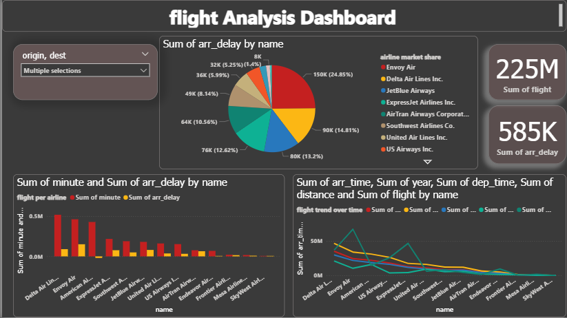

# flight-analysis-dashboard

این داشبورد تعاملی در Power BI طراحی شده شامل:
- فیلتر مبدا و مقصد پرواز برای تحلیل پویا
- نمودار دایره ای سهم خطوط هوایی
- کارت هایی برای نمایش مجموع پرواز ها و تاخیر ها
- نمودار میله ای و خطی برای مشاهده تاخیر و روند پرواز ها

هدف این پروژه تمرین تحلیل داده های پرواز و نمایش تعاملی داده ها بوده است.
